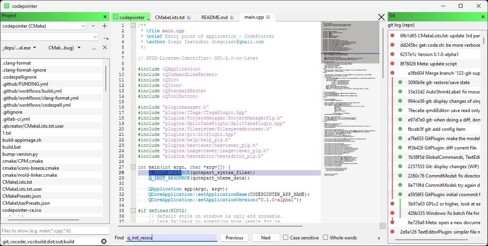

# CodePointer - an IDE for Rust, Go, C++ and more

<!--

-->

CodePointer is an IDE for Rust, Go, C++ Python and more. Its focus is local development, 
not web development. Its currently on early development. There are releases for Windows
(exe installer) and Linux (AppImage).

<!--

-->

Want to contribue? Look at [hack.md](hack.md) for guideance (TLDR: 
clone this repo, and `cmake -S build -B build; cmake --build build`, you will need a C++ compiler
, CMake and Qt installed). Keep commits readable, and rebase against main before
you open a pull-request

Code is released on the 1st of each month (usually a day, or two before), with an
RC/Beta/Alpha releases starting at the 20 of each month (sent to testing channels).

Kanban is avialble at https://github.com/users/diegoiast/projects/2
Feel free to open new issues, and work on whatever makes you happy.

## Status

Its pretty usable for a text editor. With some restrictions, can be used
as an IDE (you can load projects, build them, and execute tehe main binary from
the UI, but no debug capabilities yet, code completion is not ideal).

 * Basic editor working. Supports only UTF8. (need other? [request for it](https://gitlab.com/codepointer/codepointer))
 * Can load/build projects: CMake, Meson, Go, Cargo
 * Preview for XML, JSON, SVG (!), Markdown
 * Binary/HEX editor
 * Simple image viewer
 * Auto update with stable and testing channels
 * Command pallete (`contorl+P` - open files, `control+shift+P` commands)
 * Auto save (modified files are restored on next app start)
 * git integration is WIP

Want to see it in action? Live coding videos here: https://www.youtube.com/playlist?list=PLQeAIMKe60pMtZp3KZTmYoYXySy6UlvD3

## License
Code is GPLv2 or higher. Read each file's as some files have a less-restrictive license. 
