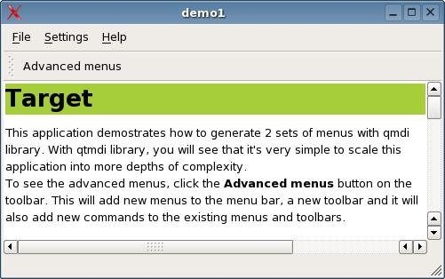
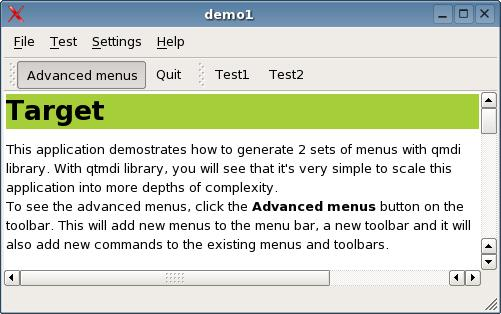
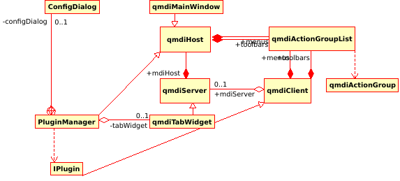

# qmdilib - library for manupulating menus/toolbars for Qt6

|          Normal menus          |          Advanced menus          |
| :----------------------------: | :------------------------------: |
|  |  |

This is a simple mdi library for Qt 6. The goal of this project,
is to provide an easy way to modifying menus and toolbars of windows
on demand. This can be used to present different menus and toolbars to
widgets inside a QTabWidget, hiding or showing a different set of menus
on demand or even enabling a small plugin system.

See the HTML manual available at the doc/html directory.

## Usage

You can consume the code as a CMake library (`git submodule` is an option), and then 
include the library. You can also use [CPM](https://github.com/cpm-cmake/CPM.cmake) (the library will eventually be added to
vcpkg and connan repos):

``` CMake
include(cmake/CPM.cmake)

# you probably don't need to build examples into your project
set(QMDILIB_BUILD_EXAMPLES off)
CPMAddPackage("gh:elcuco/qmdlib#main")
add_executable(foo  ... )
target_link_libraries(foo PRIVATE qmdlib)
```

Then follow the exaple https://github.com/elcuco/qmdilib/blob/master/demos/demo1/mainwindow.cpp 
on how to merge clients on/off by demand. 

See https://github.com/elcuco/qmdilib/blob/master/demos/demo2/mainwindow2.cpp 
for instrctions on adding different types of clients into a QTabWidget

The dessign of this library can be shown in this UML:




## License
The license of this library is LGPL version 2 or 3 as you need.

## Acknowledgements
I would like to thank these people for helping me with the development of this
library:

 * Nox PasNox <pasnox@gmail.com> for the patch for using QWorkspace as a mini
   qmdiServer when stored into a qmdiTabWidget (removed in Qt6)
 * Henry badinter <fullmetalcoder@hotmail.fr> for many suggestion in the 
   internal interfaces of qmdilib and his ediuk application which uses qmdilib 
   for many of it's internal interfaces
