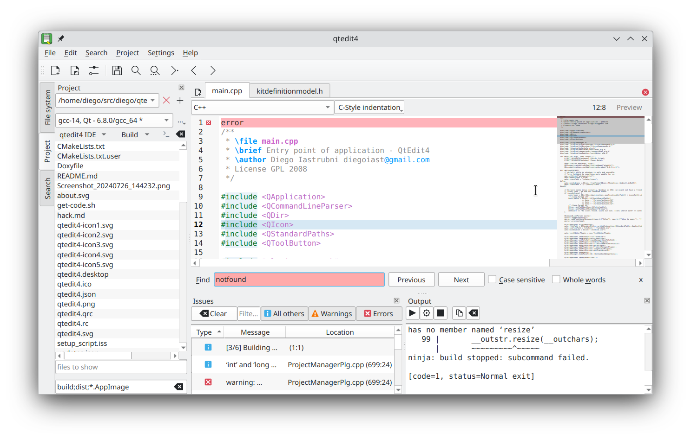

# QtEdit4 - a text editor build in Qt6  

<!-- Community 

-->

<!-- Activity -->

<!-- 

-->

qtedit4 is an IDE for Rust, Go, C++ Python and more. Its focus is local development, 
not web development. Its currently on early development. There are releases for Windows
(exe installer) and Linux (AppImage).  

## License
Code is GPLv2 or higher. Read each file's as some files have a less-restrictive license. 

## History

The code was (once) hosted under [GoogleCode svn](https://code.google.com/archive/p/qtedit4/). Since,
Google [killed this project](https://killedbygoogle.com/) the code has been migrated to git, and is 
hosted in github. Each of the sub tools got its own git repo, (which was not trivial! but doable,
using `svndumpfilter` if you ask). Now, sub tools are loaded using CPM,
as child CMake projects.

Why `qtedit4`? When Qt3 was a thing QtDesginer had the ability to edit text, and was looking
like the idea was to make it a VisualBasic kind of IDE. Back then, the designer
had an internal text editor, I think the idea was to make QtCreator more like
VisualBasic. That was abandoned.

When Qt4 was released, my original code broke and I needed a soft reboot. I 
started a new project, called qtedit4. 

This means that some of the code originated in Qt3, and got migrated to Qt6 over the last
(too much) years.

Want to contribue? Look at [hack.md](hack.md) for guideance (TLDR: 
clone this repo, and `cmake -S build -B build; cmake --build build`).

