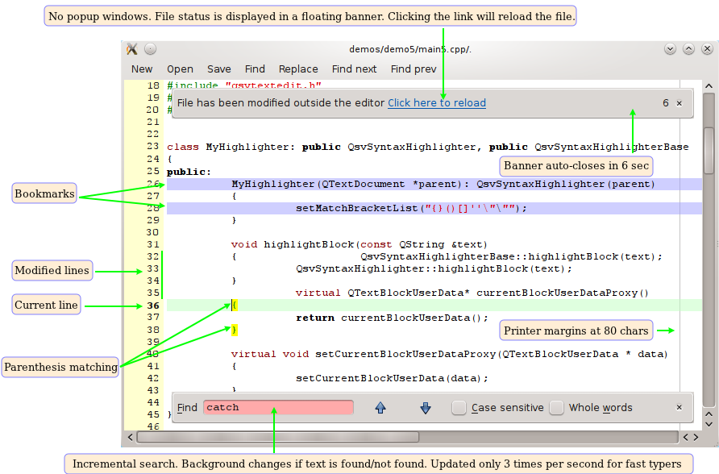

# QsvSyntaxHighlighter
This source is a collection of libraries aimed for developing a text editor.

 * QsvSyntaxHighlighter - a QSyntaxHighlighter implementation based on GtkSourceView
 * QsvTextEdit - a drop in replacement for Q{Plain}TextEdit aimed for developers
 * Qate - the next generation syntax highlighter based on Kate definitions



## Usage
You can consume the code as a CMake library (`git submodule` is an option), and then
include the library. You can also use [CPM](https://github.com/cpm-cmake/CPM.cmake) (the library will eventually be added to
vcpkg and connan repos):

``` CMake
include(cmake/CPM.cmake)

# you probably don't need to build examples into your project
set(QMDILIB_BUILD_EXAMPLES off)
CPMAddPackage("gh:elcuco/qtsourceview#main")
add_executable(foo  ... )
target_link_libraries(foo PRIVATE qsvte qsvsh)
```

To use this code in your application:

``` c++
// Generate a colors definition class and load a file:
QsvColorDefFactory *defaultColors = new QsvColorDefFactory(dataPath + "/data/colors/kate.xml");
// Intiailize the highlight factory with a directory to load the language definitions from:
QsvLangDefFactory::getInstanse()->loadDirectory(dataPath + "/data/langs/")
// Query for a language definition:
QsvLangDef *lang = QsvLangDefFactory::getInstanse()->getHighlight(fileName);
// Now Generate a QSyntaxHigliter:
QSyntaxHighliter *highlight = new QsvSyntaxHighlighter(textEdit, defColors, langCpp);
```

Another alternative, is to load the language definition yourself:
```c++
QsvLangDef *lang   = new QsvLangDef(dataPath + "/data/langs/cpp.lang");
```


## QsvSyntaxHighlighter
This is a demo of a syntax highlighter done in C++/Qt.
The code is extraeamly non optimized, but it does work most of the time.
The class is very slow, so please don't use it on large files.

The syntax highlighter definitions are the same ones used by the gtksourceview1 library
for gtk. The difinitions are passed to a class which does the highligting. This means 
that the engine is not aware of what he is coloring, and adding new languages is as
trivial as adding new XML to the langs directory.

There are 2 abstract factories on this code:
1) highligh factory: 
   Loads a directory which *.lang files, and you can query it later,
   and it will return you the languae definition for your language
   (you give it a file name and it returns a pointer to the language definition
   you need to apply to the syntax highliter)

2) colors factory:
   The language definition conatins class names for coloring, and not the actual style
   used on screen. To convert that name into color + font style we use this class.
   While this is not trully an abstract factory, in the future it may change. 
   

## QsvTextEdit
The core of a text editor is an editor control. Using QTextEdit (or QPlainTextEdit)
is not enough. You can use QsvTextEdit instead which consists:

 - Line numbering
 - Current line marking
 - Marking lines with different background
 - Bookmarks
 - Find/replace/goto line - all as inline dialogs
 - Display messages on the top of the editor
 - Theme support

## Qate

The Kate project created a set of syntax highlight definitions for
almost all languages. This library can load those definitions and you can
use them on your Q{Plain}TextEdit of QsvTextEdit to get a powerful editor.

The code was taken from the QtCreator and ported to be a standalone
code. The code was forked from QtCreator's code may 2011 (!).


All code is licensed under the terms of the LGPL.

The tests available in this release are taken from the Kate project.

The color definitions are self made, and released to the public domain (the 
syntax is part of the kate syntax definitions)

The highlight definitions are part of the gtksourceview library:
    http://gtksourceview.sourceforge.net/

The idea for highliting the current line was discussed here:
    http://www.qtcentre.org/forum/showthread.php?t=456

The code does not contain anything from the GTK source view library.
